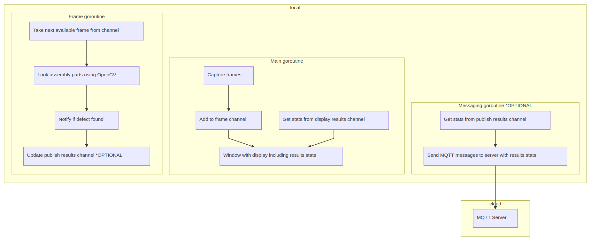

# Object Size Detector

| Details            |              |
|-----------------------|---------------|
| Target OS:            |  Ubuntu\* 16.04 LTS   |
| Programming Language: |  Go\* |
| Time to Complete:     |  45 min     |


## Introduction

This object size detector application is one of a series of reference implementations for Computer Vision (CV) using the Intel® Distribution of OpenVINO™ toolkit written in the Go* programming language. This application is designed for an assembly line camera mounted above the assembly line belt. The application monitors the size of mechanical parts as they are moving down the assembly line and raises an alert if detects that the size of the part on the belt is not within the specified area range.

This example is intended to demonstrate how to use CV to measure the approximate the size of detected assembly line parts.

## Requirements

### Hardware

* 6th Generation Intel® Core™ processor with Iris® Pro graphics and Intel® HD Graphics

### Software

* [Ubuntu\* 16.04 LTS](http://releases.ubuntu.com/16.04/)
*Note*: You must be running kernel version 4.7+ to use this software. We recommend using a 4.14+ kernel to use this software. Run the following command to determine your kernel version:

```shell
uname -a
```

* OpenCL™ Runtime Package
* Intel® Distribution of OpenVINO™ toolkit
* Go programming language v1.11+

## Setup

### Install Intel® Distribution of OpenVINO™ toolkit

Refer to https://software.intel.com/en-us/articles/OpenVINO-Install-Linux for more information about how to install and setup the Intel® Distribution of OpenVINO™ toolkit.

You will need the OpenCL™ Runtime package if you plan to run inference on the GPU as shown by the
instructions below. It is not mandatory for CPU inference.

### Install Go*

You must install the Go programming language version 1.11+ in order to compile this application. You can obtain the latest compiler from the Go website's download page at https://golang.org/dl/

For an excellent introduction to the Go programming language, check out the online tour at https://tour.golang.org

### Download the reference platform code using "go get"

You can download the reference platform code onto your computer by using the following Go command:

```shell
go get -d github.com/intel-iot-devkit/object-size-detector-go
```

Then, change the current directory to where you have installed the application code to continue the installation steps:

```shell
cd $GOPATH/src/github.com/intel-iot-devkit/object-size-detector-go
```

### Install Dep

This sample uses the `dep` dependency tool for Go. You can download and install it by running the following command:

```shell
make godep

```

### Install GoCV

Once you have installed Go, you must also install the GoCV (https://gocv.io/) package which contains the Go programming language wrappers for the Intel® Distribution of OpenVINO™ toolkit, and the associated dependencies. The easiest way to do this is by using the `dep` tool, which will satisfy the program's dependencies as defined in `Gopkg.lock` file. Run the following make file task to do so:

```shell
make dep
```

Now you should be ready to build and run the reference platform application code.

## How it works

The application uses a video source, such as a camera, to grab frames, and then uses `OpenCV` algorithms to process the captured data. It detects objects on the assembly line, such as bolts, and calculates the area they occupy. If this area is not within the predefined range as specified via command line parameters, it raises an alert to notify the assembly line operator.

The data can then optionally be sent to a remote MQTT server, as part of an assembly line data analytics system.



The program creates three Go routines for concurrency:

- Main goroutine that performs the video i/o
- Worker goroutine that processes video frames
- Worker goroutine that publishes MQTT messages to remote server

## Setting the build environment

You must configure the environment to use the Intel® Distribution of OpenVINO™ toolkit one time per session by running the following command:

```shell
source /opt/intel/computer_vision_sdk/bin/setupvars.sh
```

## Building the code

Start by changing the current directory to wherever you have git cloned the application code. For example:

```shell
cd object-size-detector-go
```

Before you can build the program you need to fetch its dependencies. You can do that by running the commands below. The first one fetches the `Go` dependency manager of our choice and the latter uses it to satisfy the program's depdencies as defined in `Gopkg.lock` file:


```shell
make godep
make dep
```

Once you have fetched the dependencies, you must export a few environment variables required to build the library from the fetched dependencies. Run the following command from the project directory:

```shell
source vendor/gocv.io/x/gocv/openvino/env.sh
```

Now you are ready to build the program binary. The project ships a simple `Makefile` which makes building the program easy by invoking the `build` task from the project root as follows:

```shell
make build
```

This commands creates a new directory called `build` in your current working directory and places the newly built binary called `monitor` into it.
Once the commands are finished, you should have built the `monitor` application executable.

## Running the code

To see a list of the various options:

```shell
./monitor -help
```

To run the application with the needed models using the webcam:

```shell
./monitor -min=10000 -max=30000
```

The `-min` flag controls the minimum size of the area the part needs to occupy to be considered good

The `-max` flag controls the maximum size of the area the part needs to occupy to be considered good

## Sample videos

There are several videos available to use as sample videos to show the capabilities of this application. You can download them by running these commands from the `object-size-detector-go` directory:

```shell
mkdir resources
cd resources
wget https://github.com/intel-iot-devkit/sample-videos/raw/master/bolt-multi-size-detection.mp4
cd ..
```

To then execute the code using one of these sample videos, run the following commands from the `object-size-detector-go` directory:

```shell
cd build
./monitor -min=20000 -max=30000 -input=../resources/bolt-multi-size-detection.mp4
```

### Machine to machine messaging with MQTT

If you wish to use a MQTT server to publish data, you should set the following environment variables before running the program:

```shell
export MQTT_SERVER=tcp://localhost:1883
export MQTT_CLIENT_ID=assemblyline1337
```

*Note:* You must always specify the server protocol -- the above example is using `TCP` protocol.

Change the `MQTT_SERVER` to a value that matches the MQTT server you are connecting to.

You should change the `MQTT_CLIENT_ID` to a unique value for each monitoring station, so you can track the data for individual locations. For example:

```shell
export MQTT_CLIENT_ID=assemblyline1337
```

If you want to monitor the MQTT messages sent to your local server, and you have the `mosquitto` client utilities installed, you can run the following command:

```shell
mosquitto_sub -t 'defects/counter'
```

### Docker*

You can also build a Docker* image and then run the program in a Docker container. First you need to build the image. You can use the `Dockerfile` present in the cloned repository and build the Docker image.

First you must obtain your own unique download URL for the Intel® Distribution of OpenVINO™ toolkit. Follow the registration process if you have not yet done so. In the registration email, you have received a link to the Registration Center website download page, shown here:


First, navigate to the download page using the link you have received. On the download page, use the "Choose Product to Download" selection box and select "Intel® Distribution of OpenVINO™ toolkit for Linux". Next, using the "Choose a Version" selection box, select "2018 R5". The "Choose a Download Option" section should appear. Right click on the button "Full Package" and choose "Copy Link Address". Your clipboard should now contain your unique download URL. Save this URL somewhere safe.

Now you can build your unique Docker image by running the following command, substituting the actual URL you obtained in the previous step:

```shell
docker build -t object-size-detector-go --build-arg OPENVINO_DOWNLOAD_URL=[your unique OpenVINO download URL here] .
```

This will produce a Docker image called `object-size-detector-go` which contains the built binary. Since the built Docker image has an [ENTRYPOINT](https://docs.docker.com/engine/reference/builder/#entrypoint) defined you can run the image as an executable using the following command:

```shell
docker run -it --rm object-size-detector-go -h
```

To run the Docker image on an Ubuntu host machine using an attached camera, run the following commands:

```shell
xhost +local:docker
docker run --device=/dev/video0:/dev/video0 -v /tmp/.X11-unix:/tmp/.X11-unix -e DISPLAY=$DISPLAY -it --rm object-size-detector-go -min=10000 -max=30000
xhost -local:docker
```

To run the Docker image on an Ubuntu host machine using a file input, run the following commands:

```shell
xhost +local:docker
docker run -v ${PWD}/resources:/resources -v /tmp/.X11-unix:/tmp/.X11-unix -e DISPLAY=$DISPLAY -it --rm object-size-detector-go -input=/resources/bolt-detection.mp4
xhost -local:docker
```

### Microsoft Azure*

If you'd like to know how you can take advantage of more advanced build system provided by [Microsoft Azure* Cloud](https://azure.microsoft.com/), please check out the Azure guide [here](./azure.md). Following the steps in the guide you can build a Docker container and push it into Azure Container Registry to make it available online.
